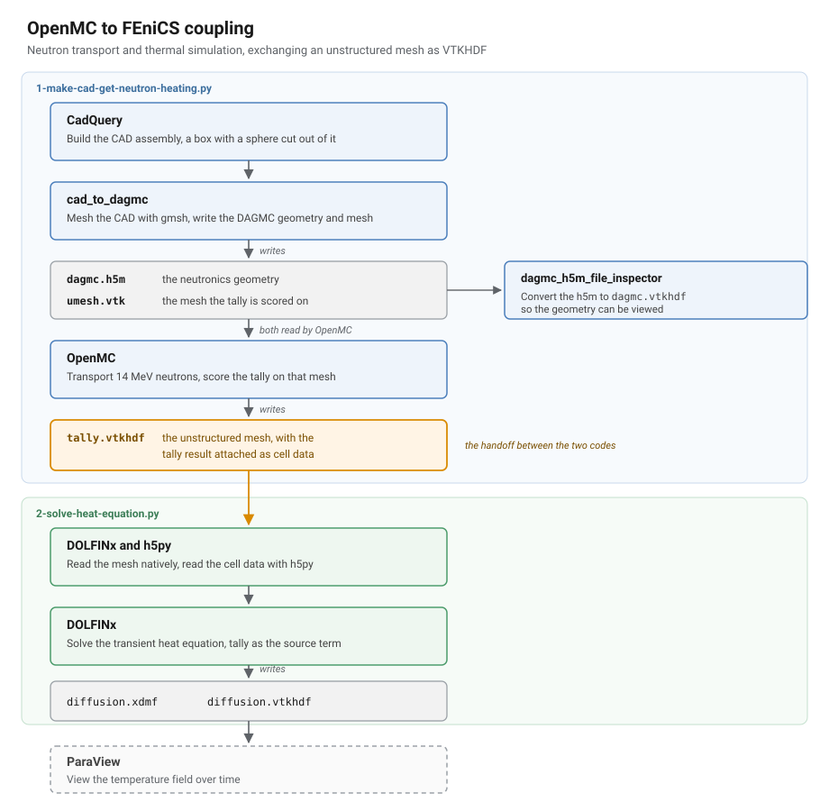
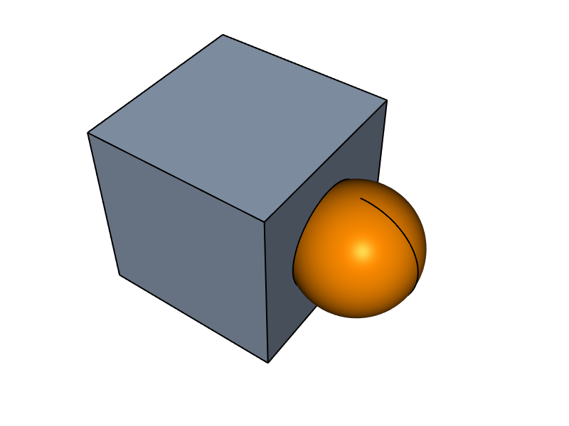
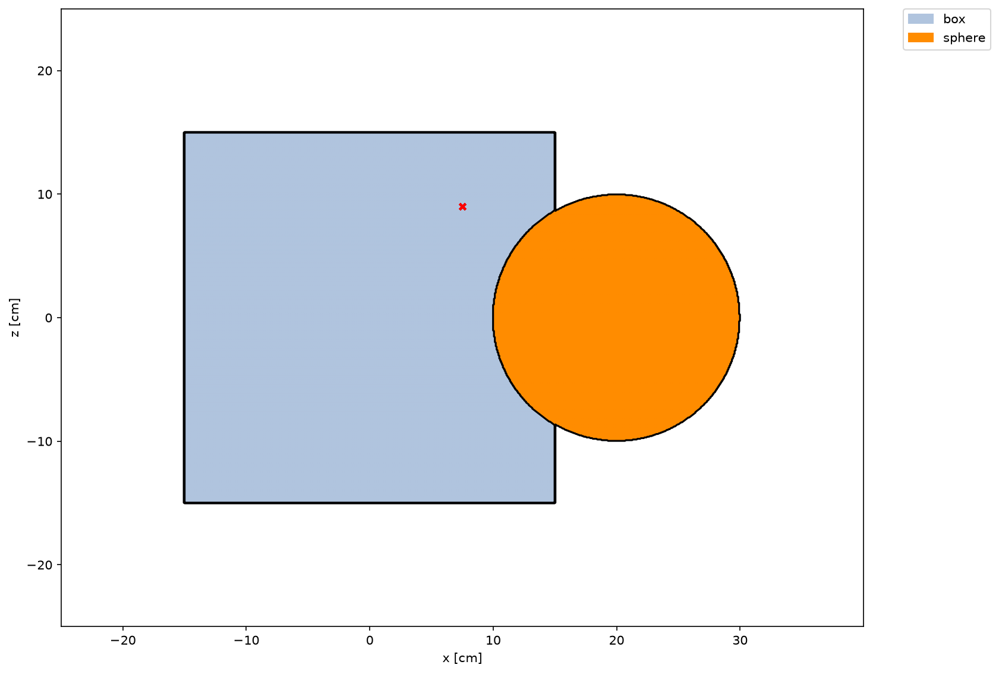
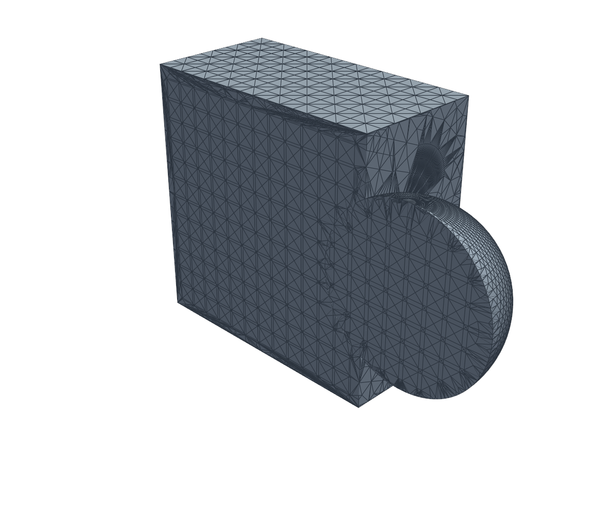
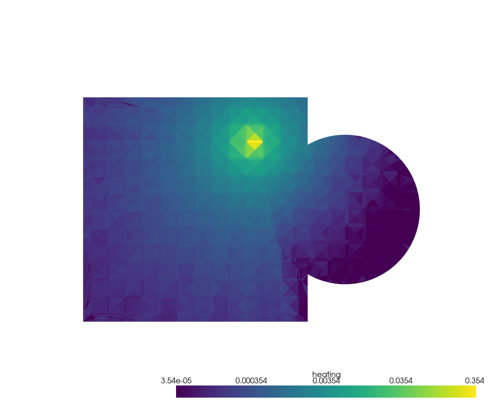
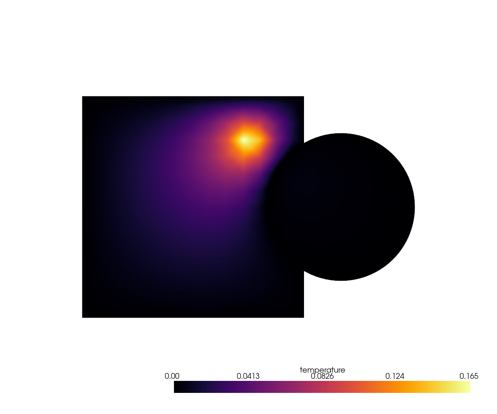

# OSSFE-Hackathon-2026

Material for the hackathon at the end of OSSFE 2026



This is not as easy as I would like. `installation-with-pip.sh` does the lot with pip in
one environment. `installation-with-conda.sh` needs pip on top for the parts conda-forge
does not carry, and cadquery and fenics-dolfinx cannot share a conda environment, so that
route needs two, see #8.

Run the scripts in order. The first one needs nuclear data, so set
`OPENMC_CROSS_SECTIONS` before running it.

```bash
python 1-make-cad-get-neutron-heating.py
python 2-solve-heat-equation.py
python 3-make-images.py
```

The CAD, a box with a sphere cut out of it and the sphere sitting in the hole, made with
CadQuery. The two are separate volumes with their own materials.



The same geometry as OpenMC sees it on the xz plane, with the materials labelled and the
sampled source positions marked, made with `openmc.Model.plot`



The tetrahedral mesh that the tally is scored on, which fills both the box and the sphere,
with half of it cut away. The three images below this one are made with PyVista.



The tally, which scores fast neutron flux between 10 and 20 MeV and stands in for the
heating here, sliced through the middle. It is on a log scale because it covers about
eight orders of magnitude.



The steady state temperature from FEniCS with the tally as the heat source, sliced through
the middle. The box and the sphere are separate meshes that do not share nodes, so the
zero temperature boundary lands on the join and no heat crosses between them, which is the
circular edge you can see, see #10.


